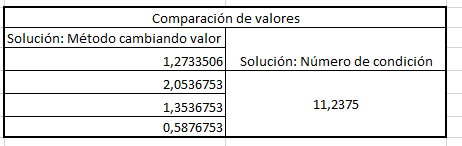

##Ejercicios   
Los siguientes ejercicios estan relacionados con el tema de sistemas de ecuaciones lineales, los cuales se solucionan utilizando métodos númericos  
Para la realización de los siguientes ejercicios instalar las librerias pracma, matrix y Rlinsolve

```{r, echo=TRUE}
library(pracma)
library(Matrix)
library(Rlinsolve)

```


1. a). Revise las siguientes funciones con la matriz A, que puede decir acerca de su funcionamiento y explique como se utilizan para descomponer la matriz A.

Respuesta: eye es una funcion utilizada para generar una matriz de identidad, recibe las dimensiones de la matriz y retorna una matriz de tamaño nxn con unos en la diagonal y ceros fuera de dicha diagonal y la almacena en la variable D1.
ones es una funcion utilizada para generar una matriz llena de unos, recibe las dimensiones de la matriz y retorna una matriz que puede ser de tamaño nxn o nxm y lo almacena en la variable D2.
zeros es una funcion utilizada para generar una matriz llena de ceros, recibe las dimensiones de la matriz y retorna una matriz que puede ser de tamaño nxn o nxm y lo almacena en la variable D3. 

b). Evalue la matriz de transición para el método $\textbf{SOR}$  y de $Jacobi$   


```{r,echo=T}
D1<-eye(4, m = 4)
D2<-ones(4, m = 4)
D3<-zeros(4, m = 4)
A = matrix(c(-8.1, -7, 6.123, -2, -1, 4,
-3, -1, 0, -1, -5, 0.6,
-1, 0.33, 6, 1/2), nrow=4, byrow=TRUE)
A

```
Respuesta:

Metodo de Jacobi:
```
library(pracma)
library(Matrix)
library(Rlinsolve)
## Overdetermined System
set.seed(100)
A = matrix(c(-8.1, -7, 6.123, -2, -1, 4,
             -3, -1, 0, -1, -5, 0.6,
             -1, 0.33, 6, 1/2), nrow=4, byrow=TRUE)
A
x = rnorm(4)
b = A%*%x

 

out1 = lsolve.jacobi(A,b,weight=1,verbose=FALSE)   # unweighted
out2 = lsolve.jacobi(A,b,verbose=FALSE)            # weight of 0.66
out3 = lsolve.jacobi(A,b,weight=0.5,verbose=FALSE) # weight of 0.50
print("* lsolve.jacobi : overdetermined case example")
print(paste("*   error for unweighted    Jacobi case : ",norm(out1$x-x)))
print(paste("*   error for 0.66 weighted Jacobi case : ",norm(out2$x-x)))
print(paste("*   error for 0.50 weighted Jacobi case : ",norm(out3$x-x)))

 

# }

```   


Merodo SOR:

```
library(pracma)
library(Matrix)
library(Rlinsolve)
A = matrix(c(-8.1, -7, 6.123, -2, -1, 4,
             -3, -1, 0, -1, -5, 0.6,
             -1, 0.33, 6, 1/2), nrow=4, byrow=TRUE)
A
x = rnorm(4)
b = A%*%x

 

out1 = lsolve.sor(A,b)
out2 = lsolve.sor(A,b,w=0.5)
out3 = lsolve.sor(A,b,w=1.5)
matout = cbind(matrix(x),out1$x, out2$x, out3$x);
colnames(matout) = c("true x","SOR 1 = GS", "SOR w=0.5", "SOR w=1.5")
print(matout)

``` 


2. Dada la siguiente matriz, utilice las funciones anteriores para descomponer la matriz $A=L+D+U$, recuerde que esta descomposición es la del metodo de (Jacobi). Verifique su respuesta   
    
Adicionalmente, verifique si A es simétrica, si A es diagonalmente dominante, justifique su respuesta  

```{r, echo=T}
A = matrix(c(-8.1, -7/4, 6.1, -2, -1, 4,
-3, -1, 0, -1, -5, 0.6,
-1, 1/3, 6, 1/2), nrow=4, byrow=TRUE)
A
```
 
 
 
 
  
  Respuesta: 
  
  Metodo de jacobi evaluado en $A=L+D+U$:

  
```
library(pracma)
library(Matrix)
library(Rlinsolve)

 

A = matrix(c(-8.1, -7/4, 6.1, -2, -1, 4,
             -3, -1, 0, -1, -5, 0.6,
             -1, 1/3, 6, 1/2), nrow=4, byrow=TRUE)
A

 


luA <- lu(A)
elu <- expand(luA)
(L <- elu$L)
(U <- elu$U)
D <- diag(diag(A))
D
A = L %*% U
A
```


Los requisitos para que una matriz sea simetrica son: 

-Que la matriz sea cuadrada es decir que el numero de filas de la matriz sea igual al numero de columnas, y esta matriz al ser una matriz 4x4 cumple la condicion.

-La matriz original debe ser igual a su matriz transpuesta, para comprobar esto se hallo la matriz transpuesta por medio del siguiente codigo:

```
library(pracma)
library(Matrix)
A = matrix(c(-8.1, -7/4, 6.1, -2, -1, 4,
             -3, -1, 0, -1, -5, 0.6,
             -1, 1/3, 6, 1/2), nrow=4, byrow=TRUE)
A
trans_A<-t(A)
trans_A

```
De esta forma se puede ver que tanto la transpuesta como la matriz A original son de 4x4, pero el resultado de la matriz transpuesta no es igual a la matriz A original por lo que esta NO es una matriz simetrica.


  b). Utilice la función itersolve(A, b, tol , method = "Gauss-Seidel") y solucionar el sistema asociado a la matriz $A$ con:   $b=[1.45,3,5.12,-4]^{t}$ con una tolerancia de error de $1e^-8$   
  
  Respuesta:
  
```
library(pracma)
A = matrix(c(-8.1, -7/4, 6.1, -2, -1, 4,
             -3, -1, 0, -1, -5, 0.6,
             -1, 1/3, 6, 1/2), nrow=4, byrow=TRUE)
A

 

b <- matrix(c(1.45,3,5.12,-4), nrow = 4, ncol = 1, byrow = TRUE)

 

cat("Mediante metodo de Gauss-Seidel\n")

 

itersolve(A, b, tol = 1e-8, method = "Gauss-Seidel")
```


c). Genere las iteraciones del método de Jacobi, calcular error relativo para cada iteracion y comparar la solución con el método de Gauss-Seidel.


  Respuesta:
  
Las iteraciones del metodo de Jacobi se generaron con el siguiente codigo:


```
itersolve <- function(A, b, x0 = NULL, 
                      nmax = 1000, tol = .Machine$double.eps^(0.5),
                      method = c("Gauss-Seidel", "Jacobi", "Richardson")) {
  stopifnot(is.numeric(A), is.numeric(b))
  
  n <- nrow(A)
  if (ncol(A) != n)
    stop("Argument 'A' must be a square, positive definite matrix.")
  b <- c(b)
  if (length(b) != n)
    stop("Argument 'b' must have the length 'n = ncol(A) = nrow(A).")
  if (is.null(x0)) {
    x0 <- rep(0, n)
  } else {
    stopifnot(is.numeric(x0))
    x0 <- c(x0)
    if (length(x0) != n)
      stop("Argument 'x0' must have the length 'n=ncol(A)=nrow(A).")
  }
  
  method <- match.arg(method)
  
  if (method == "Jacobi") {
    L <- diag(diag(A))
    U <- eye(n)
    beta <- 1; alpha <- 1
  } else if (method == "Gauss-Seidel") {
    L <- tril(A)
    U <- eye(n)
    beta <- 1; alpha <- 1
  } else {  # method = "Richardson"
    L <- eye(n)
    U <- L
    beta <- 0
  }
  
  b <- as.matrix(b)
  x <- x0 <- as.matrix(x0)
  r <- b - A %*% x0
  r0 <- err <- norm(r, "f")
  
  iter <- 0
  while (err > tol && iter < nmax) {
    iter <- iter + 1
    z <- qr.solve(L, r)
    z <- qr.solve(U, z)
    if (beta == 0) alpha <- drop(t(z) %*% r/(t(z) %*% A %*% z))
    x <- x + alpha * z
    r <- b - A %*% x
    err <- norm(r, "f") / r0
    cat("Iteraci?n ",iter," -> Error relativo = ", err,"\n")
  }
  
  cat ("\nN?mero de iteraciones realizado fue ",iter)
  
  cat ("\n\nSoluciones:")
  print(c(x))
}
A = matrix(c(-8.1, -7/4, 6.1, -2, -1, 4,
             -3, -1, 0, -1, -5, 0.6,
             -1, 1/3, 6, 1/2), nrow=4, byrow=TRUE)
A
b <- matrix(c(1.45,3,5.12,-4), nrow = 4, ncol = 1, byrow = TRUE)
cat("Mediante m?todo de Jacobi\n")

 

itersolve(A, b, nmax = 10, tol = 1e-8, method = "Jacobi")
```
\
\
\
Las iteraciones del metodo de Gauss-Seidel se generaron con el siguiente codigo:


```
library(pracma)
A = matrix(c(-8.1, -7/4, 6.1, -2, -1, 4,
             -3, -1, 0, -1, -5, 0.6,
             -1, 1/3, 6, 1/2), nrow=4, byrow=TRUE)
A

 

b <- matrix(c(1.45,3,5.12,-4), nrow = 4, ncol = 1, byrow = TRUE)

 

cat("Mediante metodo de Gauss-Seidel\n")

 

itersolve(A, b, tol = 1e-8, method = "Gauss-Seidel")
```


La tabla de comparacion entre los errores relativos de ambos metodos es la siguiente:


d). Encuentre la matriz de transición y el radio espectral    

  Respuesta:
  
La matriz de transición es generada con el siguiente codigo:

```
#Matrices necesarias
A = matrix(c(-8.1, -7, 6.123, -2, -1, 4,
-3, -1, 0, -1, -5, 0.6,
-1, 0.33, 6, 1/2), nrow=4, byrow=TRUE)
b = c(1.45,3,5.12,-4)
I<-eye(4, m = 4)
U = upper.tri(A, diag=FALSE)%*%A
L = lower.tri(A, diag=FALSE)%*%A
D = I%*%A
Di = inv(D)
b = c(1.45,3,5.12,-4)
tol <- 1e-9
#Jacobi
resJacobi = lsolve.jacobi(A,
  b,
  xinit = NA,
  reltol = 1e-05,
  maxiter = 1000,
  weight = 2/3,
  adjsym = TRUE,
  verbose = TRUE)
erroresJ = resJacobi[[3]]
iterJ = seq(1, resJacobi[[2]]+1)
plot( iterJ, erroresJ, type = "o", main = "Iteraciones vs errores \n Jacobi")
#Gauss
resGauss = itersolve(A, b, x0 = NULL, tol , method = "Gauss-Seidel")
#Matriz de transición Jacobi
Dii = -Di
TJ = Dii %*% (L + U)
cat("Matriz de transición \n")
print (TJ)
#Radio espectral
normaTJ = norm(TJ, type = c( "I"))
cat ("\n Radio espectral", normaTJ)
```

La matriz de transición en una tabla sería:


 
  
El radio espectral de una matriz es el maximo de los valores propios en valor absoluto, dada una matriz A se pueden calcular sus valores propios con la funcion $eig(A)$, si se halla el valor absouto de esa matriz y luego el maximo, entonces se tiene al radio espectral, para esto se utilizo el siguiente codigo:

```
library(pracma)
library(Matrix)
library(Rlinsolve)
A = matrix(c(-8.1, -7/4, 6.1, -2, -1, 4,
             -3, -1, 0, -1, -5, 0.6,
             -1, 1/3, 6, 1/2), nrow=4, byrow=TRUE)
A

 

radio_espectral=max(abs(eig(A)))
```


3. Sea el sistema $AX=b$ dados en ejercicio,y  con tol= e^-8        
 a. Implemente una función en R para que evalue las raíces del polinomio característico asociado a la matriz $A$ 
 
 Respuesta:
 
```

A = matrix(c(4, -1, -1, -1, -1, 4,
-1, -1, -1, -1, 4, -1,
-1, -1, -1, 4), nrow=4, byrow=FALSE)
#Computes the characteristic polynomial (and the inverse of the matrix, if requested) using the Faddeew-Leverrier method.
polinomio = charpoly(A, info = FALSE)
cat("Polinomio caracteristico ", polinomio)
```
 
 b. Use el teorema de convergencia para determinar cuál método iterativo es más favorable. 
 
 Respuesta:
 
```
library(Matrix)
A = matrix(c(4, -1, -1, -1, -1, 4,
             -1, -1, -1, -1, 4, -1,
             -1, -1, -1, 4), nrow=4, byrow=TRUE)
A
I<-eye(4, m = 4)
L = tril(A)
U = triu(A)
D = I%*%A
Di = inv(D)
#Matriz de transicion para el método de Gauss
#Inversa de la matríz diagonal
S = (upper.tri(A, diag=FALSE)%*%A) + D
w = 1
TG = inv(I + w*(Di%*%L)) %*% (-Di%*%U)
#Matriz de transicion para el método de Jacobi
TJ = -Di %*% (L + U)
#Analisis de convergencia
normaG = norm(TG, type = c( "I"))
print("Norma de Gauss")
print(normaG)
print("Matriz de trancision de Gauss")
print(TG)
cat("\n \n")
normaJ = norm(TJ, type = c("I"))
print("Norma de Jacobi")
print(normaJ)
print("Matriz de trancision de Jacobi")
print(TJ)
```
Basado en el codigo anterior las tablas para comparar ambos metodos serían:

Tabla de la matriz de trancision con el metodo de Gauss-Seidel


Tabla de la matriz de trancision con el metodo de Jacobi


teniendo en cuenta los resultados mostrados en las tablas el metodo más favorable es el metodo de Gauss-Seidel debido a que sus resultados son mucho mas pequeños a comparacion de los del metodo de Jacobi.


 c. Evalue la matriz de transición para cada caso (método) y en el caso del método de relajación determine el valor óptimo de $\omega$ 
 
 Rspuesta:
 
```
A = matrix(c(4, -1, -1, -1, -1, 4,
             -1, -1, -1, -1, 4, -1,
             -1, -1, -1, 4), nrow=4, byrow=FALSE)
I<-eye(4, m = 4)
U = triu(A)
L = tril(A)
D = I%*%A
Di = inv(D)
#Matriz de transicion para el método de Gauss
#Inversa de la matríz diagonal
S = (upper.tri(A, diag=FALSE)%*%A) + D
w = 1
TG = inv(I + w*(Di%*%L)) %*% (-Di%*%U)
#Matriz de transicion para el método de Jacobi
TJ = -Di %*% (L + U)
#Analisis de convergencia
normaG = norm(TG, type = c( "I"))
print("Norma de Gauss")
print(normaG)
print("Matriz de trancision de Gauss")
print(TG)
cat("\n \n")
normaJ = norm(TJ, type = c("I"))

 

#metodo de relajación
n=4
D1<-eye(n, m = n)
D2<-ones(n, m = n)
D3<-zeros(n, m = n)
# T =(I + wD-1L)-1( I -wD-1S)
I= D1
S = (upper.tri(A, diag=FALSE)%*%A) + D
L = tril(A)
D = D1%*%A
Di = inv(D)
w = 0
A1 = L + S
T = inv(I + w*(Di%*%L)) %*% (I - w*(Di%*%S))
normaT = norm(T, type = c("I"))
cat("Norma transición: ", normaT)
#Entre más w se acerque a 0, más pequeña será la norma de la matríz de transición
```
 d. Teniendo en cuenta lo anterior resolver el sistema
 
 Respuesta:
 
```
library(pracma)
library(Matrix)
library(Rlinsolve)

 

A = matrix(c(4, -1, -1, -1, -1, 4,
             -1, -1, -1, -1, 4, -1,
             -1, -1, -1, 4), nrow=4, byrow=TRUE)
A
b = c(1.11111, 5, 1.5,-2.33)
b
#Jacobi
X <- itersolve(A, b, method = "Jacobi")
print(X)
cat("\n")
#Sol por Gauss-Seide
X <- itersolve(A, b, tol = 1e-9 , method = "Gauss-Seidel")
print(X)
cat("\n")
#Sol por defecto
solucion<- solve(A,b)
print(solucion)
cat("\n")
```
 e Comparar con la solución por defecto 
 
  Respuesta:

El resultado por defecto es el siguiente:

```
#Resultado normal
A = matrix(c(4, -1, -1, -1, -1, 4,
             -1, -1, -1, -1, 4, -1,
             -1, -1, -1, 4), nrow=4, byrow=FALSE)
A
cat("\n")
solucion<- solve(A,b)
cat("La solución es: \n")
print(solucion)
cat("\n")
```

Observando la implementacion anterior se puede establecer una comparación en la siguiente tabla:


A pesar de que se cambia un numero en la matriz los valores de las soluciones son bastantes parecidos y en el metodo cambiando los valores que produce resultan menores.


f. Evaluar el número de condición de la matriz A  

  Respuesta:
  
El codigo para evaluar el número de condición de la matriz A es:
  
```
library(pracma)
library(Matrix)
library(Rlinsolve)

 

A = matrix(c(4, -1, -1, -1, -1, 4,
             -1, -1, -1, -1, 4, -1,
             -1, -1, -1, 4), nrow=4, byrow=TRUE)
A
b = c(1.11111, 5, 1.5,-2.33)
b
solucion<- solve(A,b)
cat("El número de condición es: ", kappa(A), "\n")
cat("\n")
```

g. Evaluar el efecto en la solución si la entrada $a_{11}=4.01$ aplicar cambio y solucionar. Después, debe comparar con el valor condicón   

```{r, echo=T}
A = matrix(c(4, -1, -1, -1, -1, 4,
-1, -1, -1, -1, 4, -1,
-1, -1, -1, 4), nrow=4, byrow=TRUE)
A
b = c(1.11111, 5, 1.5,-2.33)
b
```

  Respuesta:
  
```
#Resultado cambiando
A = matrix(c(4.01, -1, -1, -1, -1, 4,
             -1, -1, -1, -1, 4, -1,
             -1, -1, -1, 4), nrow=4, byrow=FALSE)
A
cat("\n")
solucion<- solve(A,b)
cat("La solución es: \n")
print(solucion)
cat("\n")
```

La siguiente tabla muestra la comparacion de las soluciones con el valor condicón:




4. a. Pruebe el siguiente algoritmo con una matriz $A_{6}$, modifiquelo para que $a_{ii}=0$ para todo $i$  

```{r, echo=T}
tril1 <- function(M, k = 0) {
if (k == 0) {
M[upper.tri(M, diag = FALSE)] <- 0
} else {
M[col(M) >= row(M) + k + 1] <- 0
}
return(M)
}
```

  Respuesta:

```
library(pracma)
library(Matrix)
library(Rlinsolve)

 

tril1 <- function(M, k)
{
  if (k != 0) {
    M[!lower.tri(M, diag = TRUE)] <- 0
    M[!upper.tri(M, diag = TRUE)] <- 0
  } else {
    M[col(M) == row(M) + k ] <- 0
  }
  return(M)
}
M = matrix(c(10,9,5,
             9,8,3,
             6,4,7), nrow = 3, byrow = TRUE)
ttt<- tril1(M, 0)
print(ttt)
```

5. Cree una función que cuente el número de multiplicaciones en el método directo de Gauss-Jordan, para resolver un sistema de $n$ ecuaciones y pruebelo para $n=5$  


Respuesta:

```

function(matriz){
tot<-0
for (i in 1:nrow(matriz)){
p<-matriz[i,i]
for (j in 1:ncol(matriz)){
matriz[i,j]<-matriz[i,j]/p
tot<-tot+1
}
for (j in 1:nrow(matriz)){
if(j!=i){
p<-matriz[j,i]
for (k in 1:ncol(matriz)){
matriz[j,k]<-matriz[j,k]-p*matriz[i,k]
tot<-tot+1
}
}
}
}
print(matriz)
print("Numero de operaciones: ")
print(tot)
}
```


Para $n=5$ el numero de operaciones fue de 150.


7. Dado el siguiente sistema: 

$2x-z=1$   
$\beta$$x+2y-z=2$     

$-x+y+ \alpha$$z=1$  


a. Encuentre el valor de $\alpha$ y $\beta$ para asegura la convergencia por el método de Jacobi y para Gauss Seidel. Sugerencia: utilice el teorema convergencia

  Respuesta:
  
```
library(pracma)
library(Matrix)
library(Rlinsolve)

 

beta = 0
alpha = 3
A = matrix(c(2, 0, -1,
             beta,2 , 1,
             -1, 1, alpha), nrow=3, byrow=TRUE)
TA = t(A)
if (identical(TA,A))
{
  cat ("\n La matriz es simétrica")
}
n <- nrow(A)
D <- eye(n,n)*A
M <- A-D
d = sum(abs(D))
a = sum(abs(M))
if (d >= a)
{
  cat ("\n La matriz es diagonalmente dominante","\n")
}else 
{
  cat ("\n La matriz no es diagonalmente dominante","\n")
}

 

cat("Los valores de alfa y beta son correctos porque A es símetrica y además es diagonalmente dominante")
```
Primero se comprovo si la matriz era o no simetrica y posteriormente se comprueba si es diagonalmente dominante, ya comprovando que la matriz era simetrica y diagonalmente dominante se comprueba que el valor $beta=0$ y el valor $alpha=3$.

b. Genere una tabla que tenga 10 iteraciones, del método de Jacobi con vector inicial $x_{0}=[1,2,3]^t$    

  Respuesta:

```
library(pracma)
library(Matrix)
library(Rlinsolve)

 

beta = 0
alpha = 3
A = matrix(c(2, 0, -1,
             beta,2 , 1,
             -1, 1, alpha), nrow=3, byrow=TRUE)
b = matrix (c(1,2,1),nrow=3, byrow=TRUE)
x0 = c(1,2,3)
sol = lsolve.jacobi(A,b,x0,reltol = 1e-8)
print(sol[[1]])
errores = sol[[3]]
errores = errores[c(1:10)]
iteraciones <- c(1:10)
tabla = cbind(iteraciones,errores)
print(tabla)
```
A continuacionn se muestra la tabla que tiene 10 iteraciones, del método de Jacobi con vector inicial $x_{0}=[1,2,3]^t$:


8. Instalar el paquete Matrix y descomponga la matriz $A$ (del punto dos) de la forma $LU$ y la factorizarla como $A=QR$. Verifique su respuesta.  


Respuesta:

```
library(Matrix)

A = matrix(c(4, -1, -1, -1, -1, 4,
-1, -1, -1, -1, 4, -1,
-1, -1, -1, 4), nrow=4, byrow=TRUE)

mlu = lu(A)
mlu = expand(mlu)
mlu$L

mlu$U

mlu$P

matrizqr = qr(A)

q = qr.Q(matrizqr)
r = qr.R(matrizqr)
```


9. Realice varias pruebas que la matriz de transición por el método de Gauss-Seidel esta dada por $T=(-D^{-1}U)(I+LD^{-1})^{-1}$    

  Respuesta:

```
library(Matrix)
library(Rlinsolve)
library(pracma)

A = matrix(c(4, -1, -1, -1, -1, 4,
-1, -1, -1, -1, 4, -1,
-1, -1, -1, 4), nrow=4, byrow=TRUE)

I = eye(4,4)
D = diag(diag(A))
L = tril(A)
U = triu(A)

#T=(-D^{-1}U)*(I+LD^{-1})^{-1}
#formula normal
t = (-inv(D)%*%U)%*%inv(I+L%*%inv(D))

#formula de transicion de Gauss Seidel
tWiki = -inv(L + D)%*%U

#formula cambiada
TG = inv(I + 1*(inv(D)%*%L)) %*% (-inv(D)%*%U)
```

En el código se presentan tres formulas, la formula propuesta, la formula de transición normal y la formula propuesta pero de manera invertida. La formula propuesta por el ejercicio no concuerda con la formula de matriz de transición de Gauss-Seidel ya que para el caso de multiplicación de matrices, el orden de los factores si afecta el producto.


### Sistemas No lineales  
10.
a. Determinar numéricamente la intersección entre la circunferencia $x^2 + y^2 = 1$ y la recta $y = x$. Usamos una aproximación inicial $(1,1)$.

  Respuesta:
  
```
library(BB)
ecuaciones = function(x) {
n = length(x)
F = rep(NA, n)
F[1] = x[1] - x[2]
F[2] = x[1]^2 + x[2]^2 -1
F
}
p0 = c(1,1) # n initial starting guess
sol = BBsolve(par=p0, fn=ecuaciones)
sol$par
plot(sol$par)
plot(ecuaciones)
```

La funcion BBsolve recibe como parametro un argumento par que indica a suposicion inicial de la raiz del sistema de una ecuacion no lineal, el otro parametro que recibe llamado fn es una funcion vectorial que toma la ecuacion no lineal a resolver, por ultimo la funcion intenta llegar a un valor aproximado que converja hacia el valor real.


b Analizar y comentar el siguiente código  
```{r, echo=T}
trigexp = function(x) {
n = length(x)
F = rep(NA, n)
F[1] = 3*x[1]^2 + 2*x[2] - 5 + sin(x[1] - x[2]) * sin(x[1] + x[2])
tn1 = 2:(n-1)
F[tn1] = -x[tn1-1] * exp(x[tn1-1] - x[tn1]) + x[tn1] *
( 4 + 3*x[tn1]^2) + 2 * x[tn1 + 1] + sin(x[tn1] -
x[tn1 + 1]) * sin(x[tn1] + x[tn1 + 1]) - 8
F[n] = -x[n-1] * exp(x[n-1] - x[n]) + 4*x[n] - 3
F
}
n = 10000
p0 = runif(n) # n initial random starting guesses

```
  Respuesta:
  
```
trigexp = function(x) {
#guarda el tamaño de x en n
n = length(x)
#Llena F con n elementos vacios
F = rep(NA, n)
#Asigna a F[1] la ecuación
F[1] = 3*x[1]^2 + 2*x[2] - 5 + sin(x[1] - x[2]) * sin(x[1] + x[2])
#A tn1 se le asignan los valores de la secuencia desde 2 hasta n-1
tn1 = 2:(n-1)
#Se le asigna a F[tn1] la ecuación, esto se hace n-1 veces
F[tn1] = -x[tn1-1] * exp(x[tn1-1] - x[tn1]) + x[tn1] *
( 4 + 3*x[tn1]^2) + 2 * x[tn1 + 1] + sin(x[tn1] -
x[tn1 + 1]) * sin(x[tn1] + x[tn1 + 1]) - 8
#Se asigna la ultima ecuación a F[n]
F[n = -x[n-1] * exp(x[n-1] - x[n]) + 4*x[n] - 3
F
}
n = 10000
p0 = runif(n) # n initial random starting guesses

#Se uliliza la función BBsolve para resolver el sistema de ecuaciones utilizando n valores iniciales
sol = BBsolve(par=p0, fn=trigexp)

#Muestra el resultado
sol$par
```
